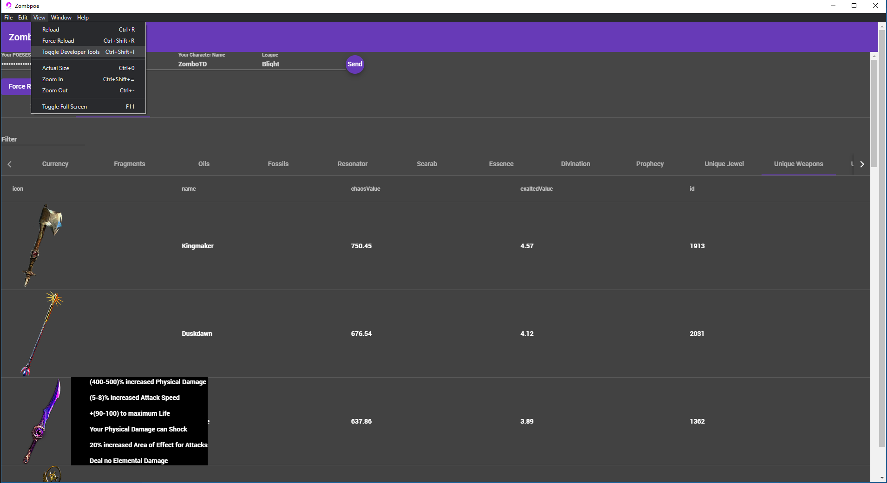
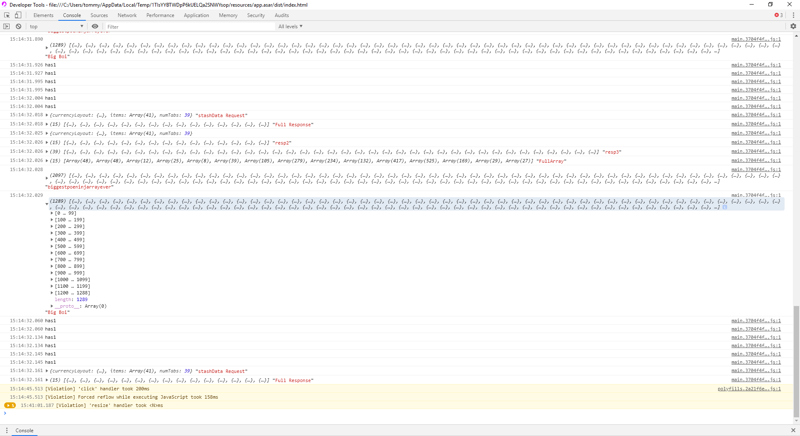

[](https://angular.io/) [](https://electronjs.org/)

# Introduction

Zombpoe is a stash indexer for Path of Exile. it uses Poe.Ninja to get the current worth of items and your POESESSID to get stash data.
Welcome to Zombpoe
This is Zombpoe
You can do anything with Zombpoe,
Anything at all,
The only Limit... is yourself!


# How to get the POESESSID?

### 1. OPEN

Official site : <https://www.pathofexile.com/>

### 2. LOG IN

Log in with your account.

### 3. GET YOUR POESESSID

[Chrome](#chrome)
　　[Firefox](#firefox)
　　[IE11](#ie11)

### 4. INPUT

Enter the SessionID to the Procurement.

---

## Chrome

1. Press the F12 key.
2. Select "Application".
3. Expand "Cookies", select the `https://www.pathofexile.com`.
4. Copy the value of the "POESESSID".

## Firefox

1. Press the F12 key.
2. Select "Storage".
3. Expand "Cookies", select the `https://www.pathofexile.com`.
4. Copy the value of the "POESESSID".

## IE11

1. Press the F12 key.
2. Select "Network".
3. Enables capture of network traffic.
4. Reload the page.
5. Select [DETAILS]-[Cookies].
6. Copy the value of "POESESSID".

---

# FAQ

### ・What is the POESESSID?

It is a temporary ID generated by Path of Exile when you login. This is basically authenticating you to your stash items.
without this you can't get your stash info until I move to oauth.

### ・Can a steam account also get a POESESSID?

Yes, when logging into the official site using steam, a POESESSID is generated which Procurement can use.

# It's not getting data 😢

If the program isnt getting data, Open the dev tools

If you see something like this

Big boi is getting data. which is all of your items in a giant array!
If you don't see anything in the biggest poeninjaraaryever we now know ur not getting poeninja data.

This program works off of API calls and I haven't yet implemented API rate limiting with axios.

I will be soon though.

Currently to fix this I am just getting the first 40 tabs if you have over 40 tabs.

Try and post to issues with a screenshot of the issue.
you can alt+printscreen the dev tools window and then ctrl+v in a comment to post the image.

# Development Section

## Bootstrap and package your project with Angular 8 and Electron (Typescript + SASS + Hot Reload) for creating Desktop applications.

Currently runs with:

- Angular v8.2.8
- Electron v6.0.10
- Electron Builder v21.2.0

With this sample, you can :

- Run your app in a local development environment with Electron & Hot reload
- Run your app in a production environment
- Package your app into an executable file for Linux, Windows & Mac

/!\ Angular 8.x CLI needs Node 10.9 or later to work.

## getting Started with development

Clone this repository locally :

```bash
git clone https://github.com/zombodotcom/Zombpoe.git
```

Install dependencies with npm :

```bash
npm install
```

There is an issue with `yarn` and `node_modules` that are only used in electron on the backend when the application is built by the packager. Please use `npm` as dependencies manager.

If you want to generate Angular components with Angular-cli , you **MUST** install `@angular/cli` in npm global context.
Please follow [Angular-cli documentation](https://github.com/angular/angular-cli) if you had installed a previous version of `angular-cli`.

```bash
npm install -g @angular/cli
```

## To build for development

- **in a terminal window** -> npm start

Voila! You can use your Angular + Electron app in a local development environment with hot reload !

The application code is managed by `main.ts`. In this sample, the app runs with a simple Angular App (http://localhost:4200) and an Electron window.
The Angular component contains an example of Electron and NodeJS native lib import.
You can disable "Developer Tools" by commenting `win.webContents.openDevTools();` in `main.ts`.

## Included Commands

| Command                    | Description                                                                                                 |
| -------------------------- | ----------------------------------------------------------------------------------------------------------- |
| `npm run ng:serve:web`     | Execute the app in the browser                                                                              |
| `npm run build`            | Build the app. Your built files are in the /dist folder.                                                    |
| `npm run build:prod`       | Build the app with Angular aot. Your built files are in the /dist folder.                                   |
| `npm run electron:local`   | Builds your application and start electron                                                                  |
| `npm run electron:linux`   | Builds your application and creates an app consumable on linux system                                       |
| `npm run electron:windows` | On a Windows OS, builds your application and creates an app consumable in windows 32/64 bit systems         |
| `npm run electron:mac`     | On a MAC OS, builds your application and generates a `.app` file of your application that can be run on Mac |

**Your application is optimised. Only /dist folder and node dependencies are included in the executable.**

## You want to use a specific lib (like rxjs) in electron main thread ?

You can do this! Just by importing your library in npm dependencies (not devDependencies) with `npm install --save`. It will be loaded by electron during build phase and added to the final package. Then use your library by importing it in `main.ts` file. Easy no ?

## Browser mode

Maybe you want to execute the application in the browser with hot reload ? You can do it with `npm run ng:serve:web`.
**Note that you can't use Electron or NodeJS native libraries in this case.** Please check `providers/electron.service.ts` to watch how conditional import of electron/Native libraries is done.

## Branch & Packages version
